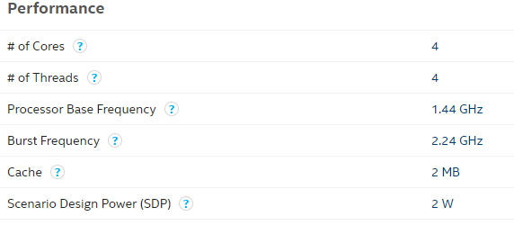
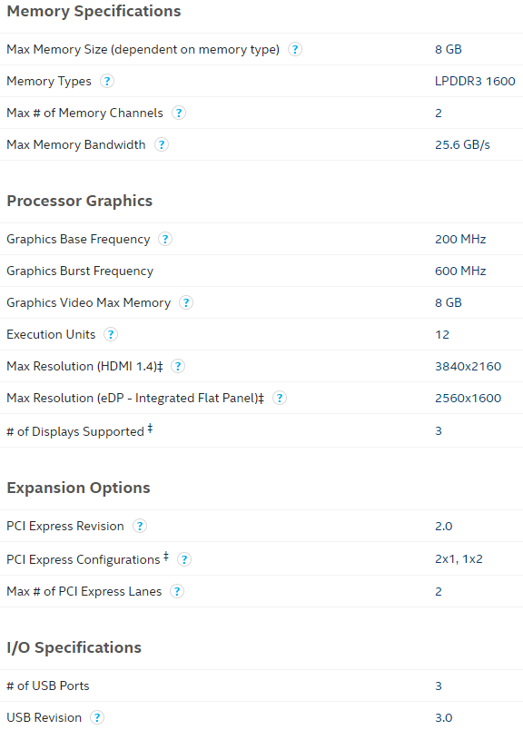
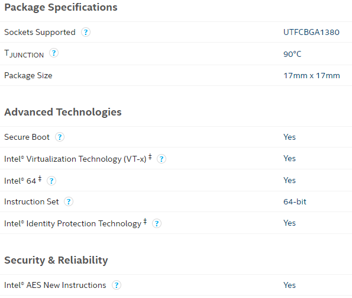

# [Z85XX](https://github.com/sochub/Z85)

 

#### 归属：[Intel Atom X](https://github.com/sochub/atom)

## [描述](https://github.com/sochub/Z85/wiki) 

应用于移动设备的 Cherry Trail-T" (14 nm)中阶产品

芯片设计 TDP 2.17 W ，UTFCBGA1380 封装 17 mm × 17 × 1.0 mm

包括  Z8500/Z8550 两个型号，1.44GHz - 2.4GHz

---

###  [SoC开发平台](http://www.qitas.cn)   

###  qitas@qitas.cn