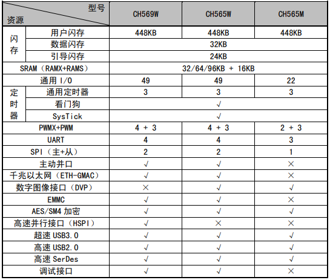

# [CH569](https://www.soc.xin/CH569)

* [WCH](http://www.wch.cn/)：[RISC-V3A](https://github.com/SoCXin/RISC-V)
* [L2R6](https://github.com/SoCXin/Level)：120 MHz , [￥33.83](https://item.szlcsc.com/3057941.html)

## [简介](https://github.com/SoCXin/CH569/wiki)

[CH569](https://www.wch.cn/products/CH569.html?) 使用120MHz主频RISC-V3A内核，单周期乘法和硬件除法、低功耗两级流水线，支持RISC-V指令的 IMAC子集。

448KB CodeFlash，32KB DataFlash，16KB的32位SRAM，32/64/96KB可配置的128位宽SRAM

片上集成超高速USB3.0主机和设备控制器（内置 PHY）、千兆以太网控制器、专用高速 SerDes 控制器（内置 PHY，可直接驱动光纤）、高速并行接口HSPI、SD/EMMC 接口控制器、加解密模块 ， 片上 128 位宽 DMA设计可保障大数据量的高速传输， 可广泛应用于流媒体、即时存储、超高速USB3.0 FIFO、通讯延长、安防监控等应用场景。

### 关键特性

* 超高速USB3.0控制及收发器（内置PHY），支持主机/设备模式、OTG功能，支持HUB
* 千兆以太网控制器（Ethernet），提供RGMII和RMII PHY接口（外部连接），支持1000Mbps传输速率
* 高速并行接口HSPI，可配置8/16/32位数据宽度，内置FIFO，支持DMA，最快传输速度约为3.8Gbps
* SerDes控制及收发器（内置PHY可直接驱动光纤），网线（仅使用1组差分线）传输90米，支持1.25Gbps高速差分信号通讯
* EMMC控制器支持单线、4线、8线数据通讯模式，符合EMMC卡4.4和4.5.1规范，兼容5.0规范
* 支持AES/SM4算法，8种组合加解密模式，支持SRAM/EMMC/HSPI外设接口数据加解密
* SPI x 2 + UART x 4 (16C550/波特率6Mbps/多触发级FIFO)
* 封装(QFN68/QFN40)

## [收录资源](https://github.com/SoCXin)

* [参考资源](src/)
* [参考文档](docs/)
* [参考工程](project/)

## [选型建议](https://github.com/SoCXin)

[CH569](https://item.szlcsc.com/3057941.html) 单芯片集成高速外设，支持USB3.0和1000Mbps以太网MAC。

[CH569](https://github.com/SoCXin/CH569)相较于[CH565](https://github.com/SoCXin/CH565)没有DVP接口，拥有HSPI。

